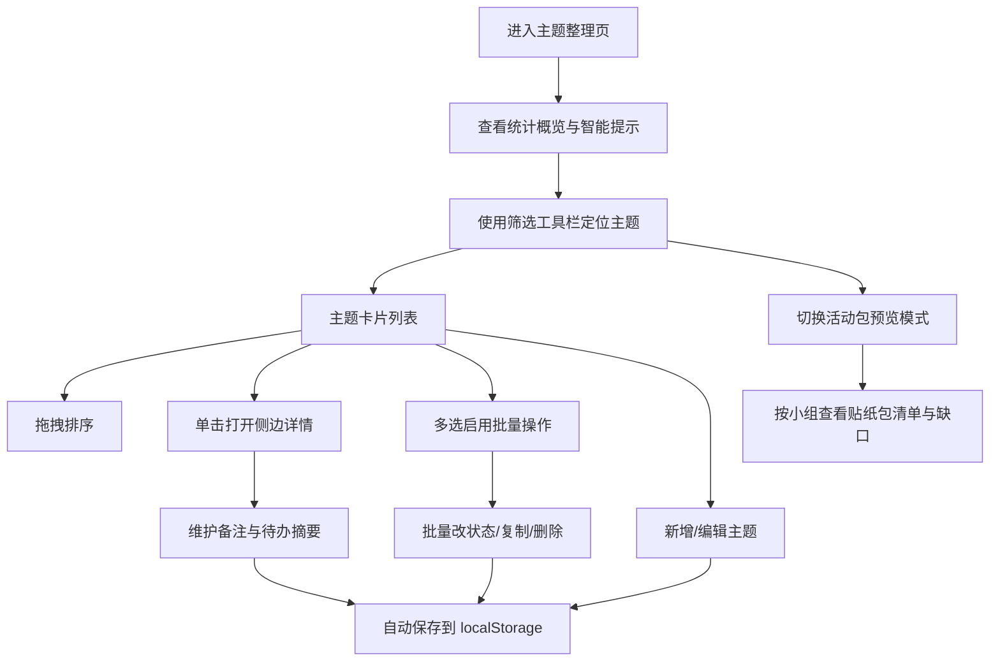

# 手账贴纸主题整理页 PRD

## 1. 产品概述
一个基于 Vue3 的纯前端单页应用，用于活动前规划手账贴纸包、主题卡和完成进度，将散乱的贴纸素材按主题维度整理、筛选与分发。
- 主要解决：贴纸活动前的主题规划混乱、数量统计模糊、责任人分工不清、缺口提醒缺失等问题
- 目标用户：手账爱好者、文创活动策划人、社群组长，帮助他们快速完成主题贴纸包的整理与分发

## 2. 核心功能

### 2.1 用户角色
本产品为纯前端单机工具，无需注册登录，所有用户拥有完整操作权限。

### 2.2 功能模块
本产品由一个主页面承载所有核心功能，包含以下模块：
1. **主题整理页**：顶部统计概览、筛选工具栏、主题卡片列表（拖拽排序）、批量操作栏、新增/编辑表单弹窗、侧边详情抽屉、活动包预览模式、智能提示中心。

### 2.3 页面详情
| 页面名称 | 模块名称 | 功能描述 |
|---------|---------|---------|
| 主题整理页 | 顶部统计概览 | 展示主题总数、贴纸总量、各状态分布饼图、平均预计用时；显示当前数据保存时间；提供导入/导出 JSON 数据按钮 |
| 主题整理页 | 筛选工具栏 | 支持按色系（多选标签）、适合页型（多选）、难度（星级）、状态（标签）、责任人（下拉）组合筛选；提供关键字搜索与清空筛选；展示当前命中条目数 |
| 主题整理页 | 主题卡片列表 | 卡片展示主题名、色系色块、贴纸数量、页型标签、难度星级、预计用时、责任人头像、状态徽章、备注摘要；支持拖拽排序（HTML5 drag-and-drop）；支持单选/多选 |
| 主题整理页 | 批量操作栏 | 选中多条记录后浮现，支持批量改状态、批量复制、批量删除；显示已选中数量 |
| 主题整理页 | 新增/编辑表单 | 弹窗表单，包含主题名、色系（预设+自定义色板）、贴纸数量、适合页型（多选）、示例说明（多行）、难度（1-5星）、预计用时（分钟）、责任人、状态、备注；支持"按主题复制"快速生成新记录 |
| 主题整理页 | 侧边详情抽屉 | 点击卡片打开右侧抽屉，展示完整字段；维护临时备注（自动保存）；维护待办摘要（增/删/勾选）；展示该主题的智能提示 |
| 主题整理页 | 活动包预览模式 | 切换为活动包视图，按当前筛选结果按责任人/小组分组生成贴纸包清单；展示每个小组可拿到的主题、总贴纸数；高亮缺口（数量不足、备注缺失）；支持打印友好视图 |
| 主题整理页 | 智能提示中心 | 自动检测：贴纸数量过少（<10）、主题名重复、同色系集中（同色系超过3条）、预计用时过长（>120分钟）、备注缺失；以折叠卡片形式聚合展示，可一键定位到目标记录 |
| 主题整理页 | 本地数据持久化 | 所有数据通过 localStorage 自动保存；首次进入提供示例数据导入；支持一键清空 |

## 3. 核心流程

用户进入页面 → 查看示例数据或导入历史 → 通过筛选工具栏定位关心的主题 → 在卡片列表上拖拽排序、点击进入详情维护备注与待办 → 选中多条进行批量改状态或复制 → 切换到活动包预览模式查看小组分发清单与缺口 → 数据自动保存至本地。

## 4. 用户界面设计

### 4.1 设计风格
- **整体调性**：温柔文具杂货风（Stationery Editorial）— 借鉴日式手账与北欧文具品牌画册的留白与排版气质，避免甜腻的卡通感
- **主色调**：纸感米白 #FBF7EE 作为底色，墨黑 #1F1B16 作为正文与高对比；点缀色为枫叶橙 #D9532C、苔藓绿 #5C7A3A、雾蓝 #6B8AA8、樱粉 #E8A4B5
- **按钮风格**：直角微圆（4px），细 1px 边框，悬停时反白填充；主操作按钮使用墨黑实心
- **字体**：标题使用 "Fraunces"（衬线、有现代变奏），正文使用 "Plus Jakarta Sans"，中文使用 "Noto Serif SC"（标题）+ "Noto Sans SC"（正文）；标题 24-32px、卡片标题 18px、正文 14px、辅助文字 12px
- **布局风格**：上下分区 + 左右双栏；卡片采用细线分隔而非阴影；网格采用不对称 12 栅格，主区 8 栏 + 侧栏 4 栏
- **图标/装饰**：使用 lucide-vue-next 细线图标；色系用圆形色块；状态用细边胶囊标签；点缀手绘风胶带条纹（CSS 渐变）作为分区装饰

### 4.2 页面设计概览
| 页面名称 | 模块名称 | UI 元素 |
|---------|---------|---------|
| 主题整理页 | 顶部统计概览 | 米白底，墨黑细线分隔；4 个统计指标横向排列，数字用 Fraunces 32px；右上角导入/导出图标按钮 |
| 主题整理页 | 筛选工具栏 | 横向胶囊标签组，多选时背景反色；搜索框带细下划线；筛选区域顶部有手绘胶带条纹装饰 |
| 主题整理页 | 主题卡片列表 | 双列网格（桌面）/单列（移动）；卡片白底细边框，左侧 4px 色系色条；拖拽时倾斜 1.5° + 阴影；空状态展示插画 |
| 主题整理页 | 批量操作栏 | 底部 fixed 浮条，墨黑实底白字；左侧显示选中数，右侧操作按钮组；进入时 slide-up 动画 |
| 主题整理页 | 新增/编辑表单 | 居中弹窗，宽 560px；表单分组带细线分隔；色系选择采用色块网格；难度用 5 星可点击 |
| 主题整理页 | 侧边详情抽屉 | 右侧 480px 抽屉，从右滑入；顶部主题名 + 色块；分块展示字段、备注、待办摘要、智能提示 |
| 主题整理页 | 活动包预览模式 | 切换为列表视图；每个小组一张大卡片，列出主题清单；缺口用枫叶橙底色高亮；提供"打印"按钮 |
| 主题整理页 | 智能提示中心 | 顶部条幅区，可折叠；不同提示类型用不同点缀色边框；点击跳转定位 |

### 4.3 响应式设计
桌面优先（≥1280px 双列），平板（768-1279px 单列宽卡片），移动（<768px 单列+底部抽屉）。触摸优化：拖拽改用长按触发，按钮最小 44px 点击区域。

