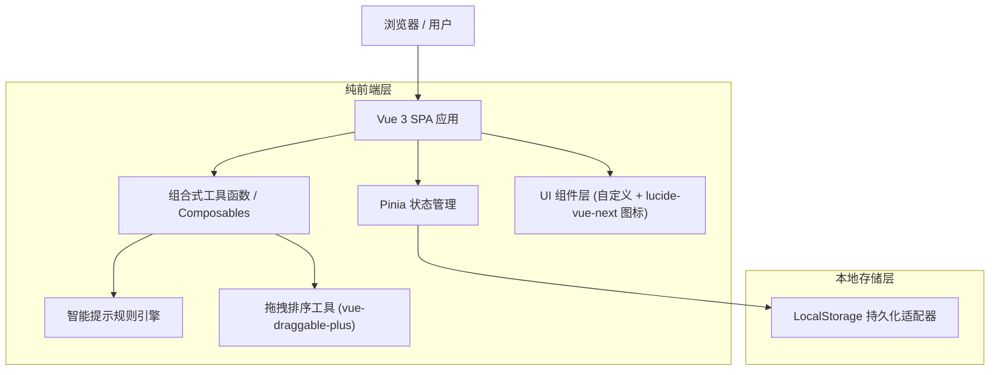
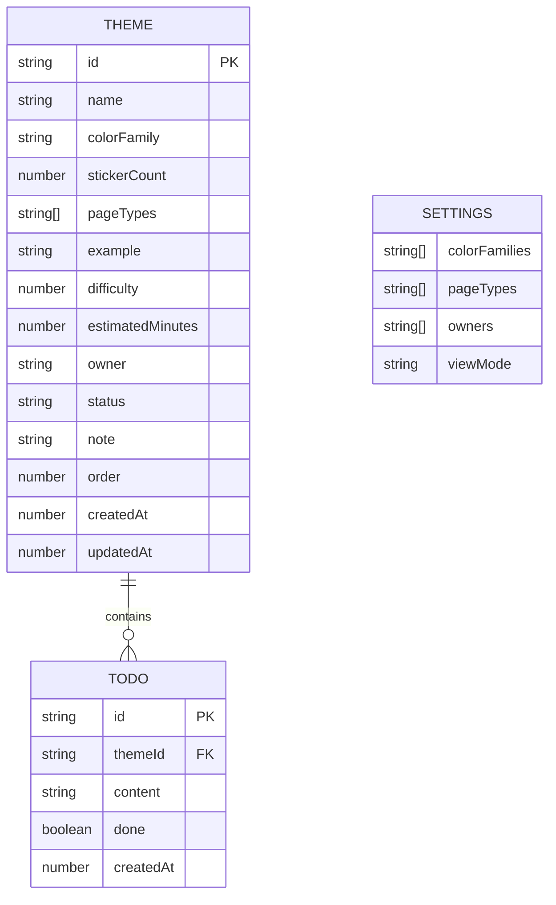

# 手账贴纸主题整理页 技术架构文档

## 1. 架构设计



## 2. 技术说明
- **前端框架**：Vue@3.4 + TypeScript@5 + Vite@5
- **初始化工具**：vite-init（`npm create vite@latest -- --template vue-ts`）
- **状态管理**：Pinia@2 + pinia-plugin-persistedstate（自动 localStorage 持久化）
- **样式方案**：原生 CSS + CSS 变量（不引入 Tailwind，保持文具杂货编辑风的精细排版控制）
- **拖拽排序**：vue-draggable-plus@0.5（基于 Sortable.js，对 Vue3 友好）
- **图标库**：lucide-vue-next
- **字体**：Google Fonts CDN 加载 Fraunces / Plus Jakarta Sans / Noto Serif SC / Noto Sans SC
- **后端**：无（纯前端单机应用）
- **数据库**：无；通过浏览器 LocalStorage 持久化，初始化提供示例数据 mock

## 3. 路由定义
本应用为单页单视图，无需路由库。通过组件内部 `mode` 状态切换"整理视图"与"活动包预览视图"。

| 路径 | 用途 |
|------|------|
| / | 主题整理页（整理视图与活动包预览视图通过状态切换） |

## 4. API 定义
本项目为纯前端应用，不涉及后端 API。所有数据操作通过 Pinia store 同步至 LocalStorage。

## 5. 数据模型

### 5.1 数据模型定义



### 5.2 数据定义语言

由于使用 LocalStorage，无 SQL DDL。以下为 TypeScript 类型定义与初始示例数据：

```typescript
// 状态枚举
export type ThemeStatus = 'pending' | 'ready' | 'shortage' | 'displayOnly' | 'paused';
// 待整理 / 可使用 / 需补充 / 仅展示 / 暂缓

// 视图模式
export type ViewMode = 'organize' | 'packagePreview';

// 待办项
export interface TodoItem {
  id: string;
  content: string;
  done: boolean;
  createdAt: number;
}

// 主题贴纸记录
export interface StickerTheme {
  id: string;
  name: string;
  colorFamily: string;            // 色系名（如 "枫叶橙"）
  stickerCount: number;
  pageTypes: string[];            // 适合页型，多选
  example: string;                // 示例说明
  difficulty: 1 | 2 | 3 | 4 | 5;
  estimatedMinutes: number;
  owner: string;                  // 责任人
  status: ThemeStatus;
  note: string;                   // 临时备注
  todos: TodoItem[];              // 待办摘要
  order: number;                  // 拖拽排序值
  createdAt: number;
  updatedAt: number;
}

// 全局配置
export interface PlannerSettings {
  colorFamilies: string[];        // 预设色系
  pageTypes: string[];            // 预设页型
  owners: string[];               // 责任人候选
  viewMode: ViewMode;
}

// 智能提示
export interface SmartTip {
  id: string;
  type: 'lowCount' | 'duplicateName' | 'colorClustered' | 'longDuration' | 'missingNote';
  level: 'info' | 'warning';
  themeIds: string[];
  message: string;
}

// 初始示例数据（10 条）
export const seedThemes: StickerTheme[] = [
  { id: 't1', name: '秋日落叶', colorFamily: '枫叶橙', stickerCount: 32, pageTypes: ['月计划', '日记'], example: '银杏、枫叶剪影、咖啡杯', difficulty: 2, estimatedMinutes: 45, owner: '林小满', status: 'ready', note: '搭配牛皮纸更出彩', todos: [], order: 0, createdAt: 0, updatedAt: 0 },
  // ... 其余 9 条主题示例
];

// 预设色系
export const defaultColorFamilies = ['枫叶橙', '苔藓绿', '雾蓝', '樱粉', '墨黑', '米白', '暖棕', '紫藤'];
// 预设页型
export const defaultPageTypes = ['月计划', '周计划', '日记', '拼贴', '收藏页', '活动记录', '票根贴'];
// 默认责任人
export const defaultOwners = ['林小满', '苏野', '陆见', '陈茉'];
```

### 5.3 智能提示规则引擎

```typescript
// 规则定义（纯函数，输入 themes，输出 SmartTip[]）
function detectLowCount(themes): SmartTip[]      // stickerCount < 10
function detectDuplicateName(themes): SmartTip[] // name 完全重复
function detectColorClustered(themes): SmartTip[]// 同 colorFamily 数量 > 3
function detectLongDuration(themes): SmartTip[]  // estimatedMinutes > 120
function detectMissingNote(themes): SmartTip[]   // note 为空且 status === 'ready'
```

### 5.4 LocalStorage 键约定

| Key | 值类型 | 说明 |
|-----|--------|------|
| `sticker-planner:themes` | StickerTheme[] | 主题记录列表 |
| `sticker-planner:settings` | PlannerSettings | 用户配置 |
| `sticker-planner:version` | string | 数据版本号，用于后续迁移 |

